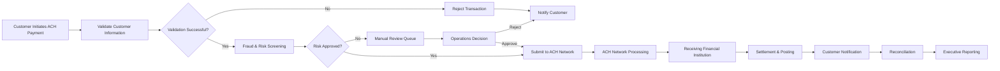

# ACH Payment Lifecycle

## Overview

This document illustrates a high-level Automated Clearing House (ACH) payment lifecycle from payment initiation through settlement and reconciliation. The example demonstrates how business analysts document payment workflows, decision points, operational controls, and exception handling within enterprise payment environments.

> **Portfolio Note:** This workflow is an original example created for demonstration purposes and does not represent any proprietary payment process.

---

# Business Objectives

* Improve payment processing efficiency
* Reduce manual intervention
* Increase straight-through processing (STP)
* Strengthen payment controls
* Improve exception management
* Enhance customer experience

---

# ACH Payment Lifecycle

---

# Operational Controls

* Customer authentication
* Payment validation
* Fraud screening
* Duplicate payment detection
* Exception handling
* Settlement verification
* Audit logging

---

# Business Risks

| Risk                        | Mitigation                     |
| --------------------------- | ------------------------------ |
| Duplicate Payments          | Automated validation rules     |
| Fraudulent Transactions     | Risk scoring & fraud screening |
| Invalid Account Information | Real-time validation           |
| Settlement Failure          | Automated reconciliation       |
| Processing Delays           | Monitoring & alerting          |

---

# KPIs

| Metric                         | Target          |
| ------------------------------ | --------------- |
| Straight-Through Processing    | 98%             |
| ACH Processing Accuracy        | 99.9%           |
| Average Processing Time        | Under 5 minutes |
| Payment Exception Rate         | Below 2%        |
| Customer Notification Delivery | 100%            |

---

# Skills Demonstrated

* Business Analysis
* Enterprise Payments
* Process Mapping
* Operational Risk
* Business Process Improvement
* Requirements Documentation
* Workflow Analysis
* Executive Reporting

