```mermaid
flowchart LR

A[Customer Requests Wire Transfer]

A --> B[Authenticate Customer]

B --> C[Validate Payment Instructions]

C --> D{Information Complete?}

D -- No --> E[Reject & Notify Customer]

D -- Yes --> F[Sanctions Screening]

F --> G[Fraud Detection]

G --> H{Approved?}

H -- No --> I[Manual Operations Review]

I --> J{Decision}

J -->|Approve| K[Submit Payment]

J -->|Reject| E

H -- Yes --> K[Submit Payment]

K --> L[Settlement Processing]

L --> M[Receiving Financial Institution]

M --> N[Funds Credited]

N --> O[Transaction Confirmation]

O --> P[Audit Logging]

P --> Q[Executive Reporting]
```

# Wire Transfer Lifecycle

## Executive Overview

Wire transfers are among the most critical financial transactions processed by commercial banks. This document illustrates a high-level wire transfer lifecycle from customer initiation through settlement, while highlighting operational controls, regulatory compliance, and risk management activities.

> **Portfolio Note:** This workflow is an original portfolio example created to demonstrate enterprise business analysis and payment operations concepts. It does not represent any proprietary banking process.

---

# Business Objectives

* Ensure secure payment processing
* Maintain regulatory compliance
* Reduce operational risk
* Improve straight-through processing
* Minimize manual intervention
* Enhance customer experience

---

# Wire Transfer Lifecycle

---

# Key Operational Controls

* Customer Authentication
* Sanctions Screening
* OFAC Compliance
* Fraud Detection
* Payment Validation
* Dual Authorization
* Audit Trail
* Exception Monitoring

---

# Risks

| Risk                      | Mitigation                      |
| ------------------------- | ------------------------------- |
| Fraud                     | Multi-layer fraud detection     |
| Incorrect Payment Details | Validation rules                |
| Regulatory Violations     | Automated compliance screening  |
| Duplicate Wires           | Duplicate transaction detection |
| Operational Errors        | Approval workflows              |

---

# Executive KPIs

| KPI                         | Target           |
| --------------------------- | ---------------- |
| Straight-Through Processing | 97%              |
| Wire Processing Accuracy    | 99.95%           |
| Fraud Detection Rate        | 99%              |
| Average Processing Time     | Under 10 Minutes |
| Compliance Exceptions       | Less than 0.5%   |

---

# Skills Demonstrated

* Commercial Banking
* Wire Transfer Operations
* Business Analysis
* Risk Management
* Governance
* Regulatory Compliance
* Workflow Documentation
* Process Improvement
* Executive Reporting

